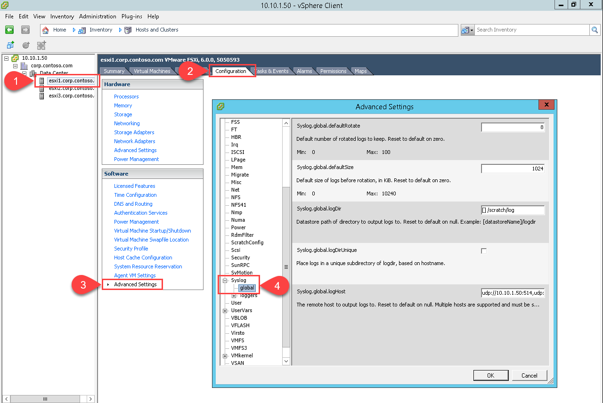

# Objective 1.1 - Perform Advanced ESXi Host Configuration
## Skills and Abilities
* Configure and Manage Auto Deploy configurations
    * Determine use case for Stateless vs Stateful installs
    * Create / Modify rules and rule sets
    * Create and associate Host Profiles for an Auto Deploy reference host
* Configure Kernel Boot Parameters for scripted install according to a deployment plan:
    * Modify scripted weasel install (ks.cfg)
    * Create / Modify scripted installation
* Configure Advanced System Settings according to a deployment plan:
    * Edit System Swap / Scratch Configuration
    * Configure ESXi host to use a central Syslog Server
* Manage/Edit the Core Dump configuration of an ESXi host

## Tools
* vSphere Installation and Setup - [docs.vmware.com](https://docs.vmware.com/en/VMware-vSphere/6.0/com.vmware.vsphere.install.doc/GUID-7C9A1E23-7FCD-4295-9CB1-C932F2423C63.html) / [pdf](https://docs.vmware.com/en/VMware-vSphere/6.0/vsphere-esxi-vcenter-server-602-installation-setup-guide.pdf)
* vCenter Server and Host Management - [docs.vmware.com](https://docs.vmware.com/en/VMware-vSphere/6.0/com.vmware.vsphere.vcenterhost.doc/GUID-3B5AF2B1-C534-4426-B97A-D14019A8010F.html) / [pdf](https://docs.vmware.com/en/VMware-vSphere/6.0/vsphere-esxi-vcenter-server-602-host-management-guide.pdf)
* What's New in the VMware vSphere 6.0 Platform - [pdf](https://www.vmware.com/files/pdf/vsphere/VMware-vSphere-Platform-Whats-New.pdf)
* vCenter Server 6.0 Deployment Guide - [pdf](https://www.vmware.com/content/dam/digitalmarketing/vmware/en/pdf/techpaper/vmware-vcenter-server6-deployment-guide-white-paper.pdf)
* vSphere Upgrade - [docs.vmware.com](https://docs.vmware.com/en/VMware-vSphere/6.0/com.vmware.vsphere.upgrade.doc/GUID-18B7B4BB-C24A-49CD-AE76-13285157B29F.html) / [pdf](https://docs.vmware.com/en/VMware-vSphere/6.0/vsphere-esxi-vcenter-server-602-upgrade-guide.pdf)
* vSphere Client / vSphere Web Client
* esxcli


### Edit System Swap / Scratch Configuration


### Configure ESXi host to use a central Syslog Server
There are five Advanced system settings available for configuring Syslog on a host:

Setting | Description
------- | -----------
Syslog.global.defaultRotate | Default number of rotated logs to keep
Syslog.global.defaultSize | Default size of logs before rotation, in KiB
Syslog.global.LogDir | Datastore path of directory to output logs to
Syslog.global.logDirUnique | Place logs in a unique subdirectory of logdir, based on hostname
Syslog.global.LogHost | The remote host to output logs to

Can be changed in Web Client at: 
Browse to the host...Manage...Settings...Advanced System Settings...search for syslog.global


C# Client:
Browse to the host...Configuration...Advanced Settings...Syslog...global



esxcli:
Use the ```esxcli system syslog config set``` commands to set the options:
~~~
[root@esxi1:~] esxcli system syslog config set --help
Usage: esxcli system syslog config set [cmd options]

Description:
  set      	            	Set global log configuration options

Cmd options:
  --check-ssl-certs 	    Verify remote SSL certificates against the local CA Store
  --default-rotate=<long>	Default number of rotated local logs to keep
  --default-size=<long> 	Default size of local logs before rotation, in KiB
  --default-timeout=<long>	Default network retry timeout in seconds if a remote server fails to respond
  --drop-log-rotate=<long>	Number of rotated dropped log files to keep
  --drop-log-size=<long>	Size of dropped log file before rotation, in KiB
  --logdir=<str>        	The directory to output local logs to
  --logdir-unique       	Place logs in a unique subdirectory of logdir, based on hostname
  --loghost=<str>       	The remote host(s) to send logs to
  --queue-drop-mark=<long>	Message queue capacity after which messages are dropped
  --reset=<str>         	Reset values to default
~~~

Make sure to run the command ```esxcli system syslog reload``` to set the changes.

PowerCLI:
One command needed

~~~ posh
Set-VMHostSysLogServer -SysLogServer 'IP of Syslog Server' -VMHost 'Hostname of esxi host'
~~~
